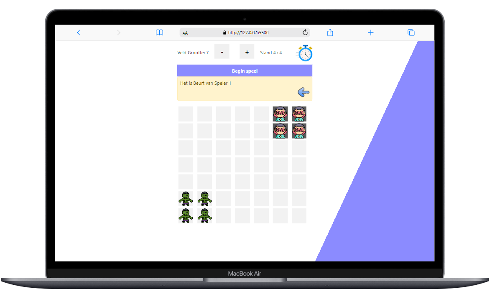

  
  <h1 align="center">Play Now: Human Intelligence vs. AI Board Game</h1>
  

  Dit speel is als een uitdaging van The Hague University geweest om als student binnen 12 uur een krachtig spel te creëren met hun strenge regels + en zelf gemaakte algoritme om een computer speler toe te voegen die niet makkelijk te verslaan door het gebruik van kunstmatige intelligentie . 
  Ik heb tijdens het maken van deze speel geen gebruik gemaakt van YouTube of andere bronnen zoals ChatGPT of Google. 
    </b>
   
   Menselijke intelligentie vs kunstmatige intelligentie. 
    
   Het is in Nederlands.  Het zou gemakkelijker en nog beter geweest als we zonder strenge regels van universiteit aan de slag gingen. 
    
   
 
 This game has been as a challenge from The Hague University to create a powerful game within 12 hours with their strict rules + and self -made algorithm to add a computer player that is not easy to beat through the use of artificial intelligence.
   While making this play, I did not use YouTube or other sources such as Chatgpt or Google.
    
    Human intelligence vs artificial intelligence.
   
  
 It is in Dutch. It would be easier and even better if we started working without strict rules from University. 

     
  

  <h2 align="center"> Getting Started</h2>

 
To start game and play, <b>just open html file in browser.</b>
 
-------------------------------------------------------

To make go back 1 step working, go to <b>stapel-main/App</b>
 
and run this command after installing dotnet on your pc : <b> [dotnet run] </b>
 
[https://codershiyar.github.io/boardgame/]

  
